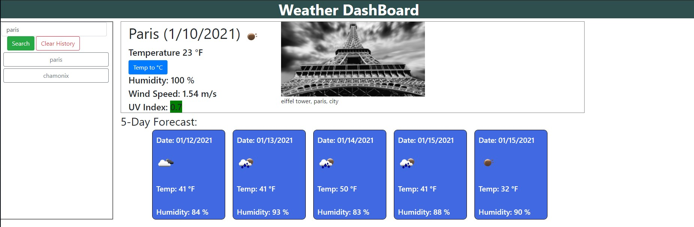

# Table of Contents
- [Homework Presentation](#homework-presentation)
- [Acceptance Criteria](#acceptance-criteria)
- [links](#links)
- [ScreenShot](#screenshot)
- [Assignment Approach](#assignment-approach)
- [Functions Details](#functions-details)
    - [getCity()](#getcity())
    - [updateCurrent(response)](#updatecurrent(response))
    - [updateForecast(response)](#updateforecast(response))
    - [KtoF(Kdegre)](#ktof(kdegre))
    - [addHistory(city)](#addhistory(city))
    - [displayHistory()](#displayhistory())
    - [getPicture(city)](#getpicture(city))
- [Room For Improvements](#room-for-improvements())
- [Credits](#credits)

# Homework Presentation
Server-Side APIs: Weather Dashboard  
Developers are often tasked with retrieving data from another application's API and using it in the context of their own. Third-party APIs allow developers to access their data and functionality by making requests with specific parameters to a URL. Your challenge is to build a weather dashboard that will run in the browser and feature dynamically updated HTML and CSS.
Use the OpenWeather API to retrieve weather data for cities. The documentation includes a section called "How to start" that will provide basic setup and usage instructions. Use localStorage to store any persistent data.

# Acceptance Criteria
GIVEN a weather dashboard with form inputs  
WHEN I search for a city  
THEN I am presented with current and future conditions for that city and that city is added to the search history  
WHEN I view current weather conditions for that city  
THEN I am presented with the city name, the date, an icon representation of weather conditions, the temperature, the humidity, the wind speed, and the UV index  
WHEN I view the UV index  
THEN I am presented with a color that indicates whether the conditions are favorable, moderate, or severe  
WHEN I view future weather conditions for that city  
THEN I am presented with a 5-day forecast that displays the date, an icon representation of weather conditions, the temperature, and the humidity  
WHEN I click on a city in the search history  
THEN I am again presented with current and future conditions for that city  
WHEN I open the weather dashboard  
THEN I am presented with the last searched city forecast

# Links
[Repository Folder](https://github.com/nhounhou/Homework6)  
[Weather Tool](https://nhounhou.github.io/Homework6)

# ScreenShot
  

# Assignment Aproach
Giving all the acceptance criteria, I tried to have the webpage to look as much as possible to the sample given to us.  
But I choose to have the clickable list of past cities searched to be a list of `button` element so they would be easier to handle the event associated with them.  
I also add a "Clear History" `button` that will clear the list of button as well as clear the `localStorage` property and hide the weather data for the current city search and forecast data, as if the user was starting with a first search.  
All the `elements` on the webpage are responsive and will resize depending on the siZe of the screen.  
The `buttons` from the search list resize to the width of their parent element.  
If there is data saved in the `localStorage` for this tool, the webpage will generate the list of cities searched, and the click event for the buttons will be handled.  

I also add the Pixabay API to get a random picture of the city searched. The picture will be showned next to the current weather data.

# Functions Details
### <ins>getCity()
Main function that will make 3 calls to the OpenWeatherMap API:  
- to get the data for the city searched.
- to get the UV Index data.
- to get the 5 days forecast data  .

The function will also call the `updateCurrent`, `updateForecast` and `getPicture` functions.

### <ins>updateCurrent(response)
The function will display teh data from the result of the API for the city entered in the textbox "search".

### <ins>updateForecast(response)
The function will build and display the forecast for the next 5 days from the current date for the city selected.

### <ins>KtoF(Kdegre)
Function that convert the Kelvin temperature to Fahrenheit temperature.

### <ins>addHistory(city)
Function that will add the city to the `localStorage`.

### <ins>displayHistory()
Function that will read (get) the data saved in the `localStorage` and display the data with a list of button. So the user can select the cities already searched and get the current weather data.

### <ins>getPicture(city)
Function that take one parameter. That parameter is the city of which the function will get a picture related to the city.  
The picture will be fetch by the call to the Pixabay API. The return can be up to 25 differents picture, the function will randomly select one to be displayed on the page, next to the current weather data.

# Room for Improvements
- 2 more `button` can be added to the tool to do a Temperature (to Celsius) and length (to metric) conversion.

# Credits
[OpenWeatherMap API](https://openweathermap.org)  
[Pixabay API](https://pixabay.com)